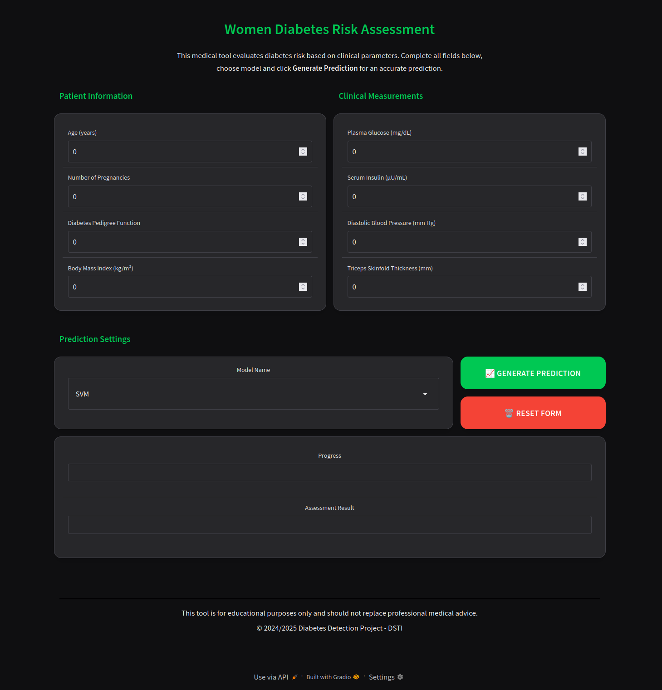

# 🩺 Diabetes Detection Project

A machine learning-based web application for predicting diabetes risk in women based on health metrics.

## 📋 Overview

This project uses several machine learning algorithms to predict the likelihood of diabetes in women based on key health indicators. The models are trained on a dataset containing health metrics and have been optimized for accuracy and performance.



## ✨ Features

- Multiple trained machine learning models:
  - 🌲 Random Forest
  - 📈 Logistic Regression
  - 🔄 AdaBoost
  - 🚀 Gradient Boosting
  - 🧠 K-Nearest Neighbors (KNN)
  - ⚙️ Support Vector Machine (SVM)
  - 🌳 Decision Tree
- 🖥️ Interactive web interface for predictions
- 📊 Comprehensive model evaluation and comparison
- 📉 Data visualization and analysis

## 💾 Dataset

## 💾 Dataset

The project uses the TAIPEI_diabetes.csv dataset, containing health metrics for 15000 women with these features:

- 🤰 Pregnancies: Number of times pregnant
- 🩸 PlasmaGlucose: Plasma glucose concentration after 2 hours in an oral glucose tolerance test
- ❤️ DiastolicBloodPressure: Diastolic blood pressure (mm Hg)
- 📏 TricepsThickness: Triceps skin fold thickness (mm)
- 💉 SerumInsulin: 2-Hour serum insulin (mu U/ml)
- ⚖️ BMI: Body mass index (weight in kg/(height in m)^2)
- 👪 DiabetesPedigree: A function that scores the probability of diabetes based on family history
- 🗓️ Age: Age in years

Target variable:
- 🩺 Diabetic: 1 = diabetes diagnosed, 0 = no diabetes diagnosed

## 🛠️ Installation

This project requires **Python 3.8+**. You can use either pip with a virtual environment or Conda for dependency management.

### Option 1: Using pip and virtual environment

1. Clone this repository:

```
git clone https://github.com/YoucefLgr/Diabetes_Detection.git
cd Diabetes_Detection
```

2. Create and activate a virtual environment:

```
python -m venv diabetes_detection_env
```

On Windows:
```
diabetes_detection_env\Scripts\activate
```

On macOS/Linux:
```
source diabetes_detection_env/bin/activate
```

3. Install the required packages:

```
pip install -r requirements.txt
```

### Option 2: Using Conda

1. Clone this repository:

```
git clone https://github.com/YoucefLgr/Diabetes_Detection.git
cd Diabetes_Detection
```

2. Create and activate a Conda environment:

```
conda create --name diabetes_detection python=3.9
```

On Windows/macOS/Linux:
```
conda activate diabetes_detection
```

3. Install the required packages:

```
conda install --file requirements.txt
```

Alternative if you encounter issues with the above:
```
pip install -r requirements.txt
```
## 🚀 Usage

### Running the Web Application

To start the web application:

```
python app.py
```

The application will be accessible at http://localhost:7860 in your web browser.

### Using the Application

1. ✏️ Enter the patient's health metrics in the provided fields
2. 🔍 Select the preferred model type from the dropdown menu
3. 🔮 Click the "Predict" button to get the diabetes risk assessment
4. 🔄 Use the "Clear" button to reset all fields

## 🚀 Development

### Running All Notebooks

To run all notebooks in the correct sequence (which will update models):

> ⚠️ **Disclaimer**: Be aware of the processing time which may take half an hour or even more depending on your machine.

```bash
python run_notebooks.py
``` 

### Expected Processing Times

Different systems will have different processing times for running all notebooks:

- **Ubuntu laptop with Razer Blade specs**: ~12 minutes
  - RTX 4070 GPU
  - Ryzen 9 8945HS CPU
  - 32GB RAM

Your processing time may vary depending on your system's specifications.


## 📁 Project Structure

- `app.py` - The Gradio web application for diabetes prediction
- `run_notebooks.py` - Script to run all notebooks in sequence
- `requirements.txt` - List of project dependencies
- `README.md` - Project documentation
- `datasets/` - Data files for model training
  - `TAIPEI_diabetes.csv` - Original dataset
  - `Processed_data.csv` - Cleaned and processed dataset with engineered features
- `models/` - Trained model files
  - `ada_boost_model.pkl` - AdaBoost classifier
  - `decision_tree_model.pkl` - Decision Tree classifier
  - `gradient_boosting_model.pkl` - Gradient Boosting classifier
  - `knn_model.pkl` - K-Nearest Neighbors classifier
  - `log_model.pkl` - Logistic Regression classifier
  - `log_scaler.pkl` - Feature scaler for Logistic Regression
  - `random_forest.pkl` - Random Forest classifier
  - `rf_scaler.pkl` - Feature scaler for Random Forest
  - `svm_model.pkl` - Support Vector Machine classifier
- `notebooks/` - Jupyter notebooks for data analysis and model development
  - `MLProject - DEA.ipynb` - Data exploration and analysis
  - `MLProject - AdaBoost_and_GradientBoosting.ipynb` - AdaBoost and Gradient Boosting models
  - `MLProject - KNN_Algorithm.ipynb` - KNN implementation
  - `MLProject - Logistic_Regression.ipynb` - Logistic Regression model
  - `MLProject - Decision_Tree.ipynb` - Decision Tree implementation
  - `MLProject - SVM.ipynb` - Support Vector Machine implementation
  - `MLProject - Random_Forest.ipynb` - Random Forest implementation
- `image/` - Images for documentation
  - `README/` - Images used in README
    - `webapp.png` - Screenshot of the web application

## 📈 Model Performance

The models achieve accuracy scores of ~77-93% with different strengths:
- 🌲 Random Forest: Best overall performance with balanced precision and recall
- 📈 Logistic Regression: Good interpretability and baseline performance
- 🔄 AdaBoost: Strong performance on difficult cases
- 🚀 Gradient Boosting: High accuracy with sequential error correction
- ⚙️ SVM: Effective decision boundary for this classification task
- 🧠 KNN: Simple but effective for this dataset
- 🌳 Decision Tree: Good interpretability and visualization capabilities

## 💻 Main Technologies Used

- 🐍 Python
- 🧪 Scikit-learn
- 🐼 Pandas
- 🔢 NumPy
- 📊 Matplotlib
- 🌊 Seaborn
- 🌐 Gradio

## 🔮 Future Improvements

- 📊 Add feature importance visualization
- 🤝 Implement ensemble methods combining multiple models
- 🔐 Add user authentication and result storage
- ☁️ Deploy the application to a cloud platform

## 📝 Git Commit Guidelines

We follow these best practices for Git commit messages to maintain a clean and informative history:

### Commit Message Format

```
<emoji> <type>(<scope>): <subject>
```

### Commit Types with Emojis

- ✨ `:sparkles:` - `feat`: A new feature
- 🐛 `:bug:` - `fix`: A bug fix
- 📚 `:books:` - `docs`: Documentation only changes
- 💅 `:nail_polish:` - `style`: Code style changes (formatting, semicolons, etc)
- 🛠️ `:hammer_and_wrench:` - `refactor`: Code refactoring (no functional changes)
- 🚀 `:rocket:` - `perf`: Performance improvements
- ✅ `:white_check_mark:` - `test`: Adding or updating tests
- 🔧 `:wrench:` - `chore`: Build processes, tooling changes, etc
- 🗑️ `:wastebasket:` - `chore`: Removing deprecated code
- ⚙️ `:gear:` - `ci`: CI configuration changes
- 📦 `:package:` - `build`: Changes related to build system
- 🔄 `:arrows_counterclockwise:` - `revert`: Revert to a previous commit

### Examples of Good Commit Messages

```
✨ feat(models): add gradient boosting classifier
```

```
📚 docs(readme): update installation instructions

Added conda installation steps and fixed typos in requirements section.
```

### Tips for Good Commit Messages

1. Keep the subject line concise (50 chars or less)
2. Use imperative mood in the subject ("add" not "added")
3. Don't end the subject line with a period
4. Separate subject from body with a blank line
5. Use the body to explain what and why, not how
6. Reference issues and pull requests in the footer

This practice helps maintain a clean history and makes it easier to generate release notes automatically.

## 📜 License

This project is licensed under the MIT License - see the LICENSE file for details.